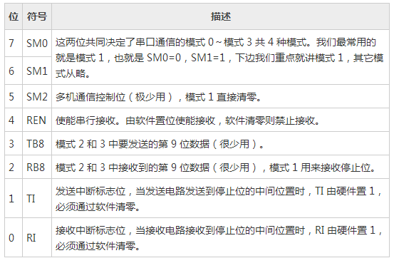

# 11.5 UART 串口通信的基本应用

## 通信的三种基本类型

常用的通信从传输方向上可以分为单工通信、半双工通信、全双工通信三类。

单工通信就是指只允许一方向另外一方传送信息，而另一方不能回传信息。比如电视遥控器、收音机广播等，都是单工通信技术。

半双工通信是指数据可以在双方之间相互传播，但是同一时刻只能其中一方发给另外一方，比如我们的对讲机就是典型的半双工。

全双工通信就发送数据的同时也能够接收数据，两者同步进行，就如同我们的电话一样，我们说话的同时也可以听到对方的声音。 

## UART 模块介绍

IO 口模拟串口通信，让大家了解了串口通信的本质，但是我们的单片机程序却需要不停的检测扫描单片机 IO 口收到的数据，大量占用了单片机的运行时间。这时候就会有聪明人想了，其实我们并不是很关心通信的过程，我们只需要一个通信的结果，最终得到接收到的数据就行了。这样我们可以在单片机内部做一个硬件模块，让它自动接收数据，接收完了，通知我们一下就可以了，我们的51单片机内部就存在这样一个 UART 模块，要正确使用它，当然还得先把对应的特殊功能寄存器配置好。

51单片机的 UART 串口的结构由串行口控制寄存器 SCON、发送和接收电路三部分构成，先来了解一下串口控制寄存器 SCON。如表11-1表11-2所示。

表11-1 SCON——串行控制寄存器的位分配（地址 0x98、可位寻址）

|位|7|6|5|4|3|2|1|0|
|:- 
|符号|SM0|SM1|SM2|REN|TB8|RB8|TI|RI|
|复位值|0|0|0|0|0|0|0|0|

表11-2 SCON——串行控制寄存器的位描述



前边学了那么多寄存器的配置，相信 SCON 这个地方，对于大多数同学来说已经不是难点了，应该能看懂并且可以自己配置了。对于串口的四种模式，模式1是最常用的，就是我们前边提到的1位起始位，8位数据位和1位停止位。下面我们就详细介绍模式1的工作细节和使用方法，至于其它3种模式与此也是大同小异，真正遇到需要使用的时候大家再去查阅相关资料就行了。

在我们使用 IO 口模拟串口通信的时候，串口的波特率是使用定时器 T0 的中断体现出来的。在硬件串口模块中，有一个专门的波特率发生器用来控制发送和接收数据的速度。对于STC89C52 单片机来讲，这个波特率发生器只能由定时器 T1 或定时器 T2 产生，而不能由定时器 T0 产生，这和我们模拟的通信是完全不同的概念。

如果用定时器2，需要配置额外的寄存器，默认是使用定时器1的，我们本章内容主要就使用定时器 T1 作为波特率发生器来讲解，方式1下的波特率发生器必须使用定时器 T1 的模式2，也就是自动重装载模式，定时器的重载值计算公式为：

```
    TH1 = TL1 = 256 - 晶振值/12 /2/16 /波特率
```

和波特率有关的还有一个寄存器，是一个电源管理寄存器 PCON，他的最高位可以把波特率提高一倍，也就是如果写 PCON |= 0x80 以后，计算公式就成了：

```
    TH1 = TL1 = 256 - 晶振值/12 /16 /波特率
```

公式中数字的含义这里解释一下，256是8位定时器的溢出值，也就是 TL1 的溢出值，晶振值在我们的开发板上就是11059200，12是说1个机器周期等于12个时钟周期，值得关注的是这个16，我们来重点说明。在 IO 口模拟串口通信接收数据的时候，采集的是这一位数据的中间位置，而实际上串口模块比我们模拟的要复杂和精确一些。他采取的方式是把一位信号采集16次，其中第7、8、9次取出来，这三次中其中两次如果是高电平，那么就认定这一位数据是1，如果两次是低电平，那么就认定这一位是0，这样一旦受到意外干扰读错一次数据，也依然可以保证最终数据的正确性。

了解了串口采集模式，在这里要给大家留一个思考题。“晶振值/12/2/16/波特率”这个地方计算的时候，出现不能除尽，或者出现小数怎么办，允许出现多大的偏差？把这部分理解了，也就理解了我们的晶振为何使用 11.0592 M 了。

串口通信的发送和接收电路在物理上有2个名字相同的 SBUF 寄存器，它们的地址也都是 0x99，但是一个用来做发送缓冲，一个用来做接收缓冲。意思就是说，有2个房间，两个房间的门牌号是一样的，其中一个只出人不进人，另外一个只进人不出人，这样的话，我们就可以实现 UART 的全双工通信，相互之间不会产生干扰。但是在逻辑上呢，我们每次只操作 SBUF，单片机会自动根据对它执行的是“读”还是“写”操作来选择是接收 SBUF 还是发送 SBUF，后边通过程序，我们就会彻底了解这个问题。 

## UART 串口程序

一般情况下，我们编写串口通信程序的基本步骤如下所示： 
1. 配置串口为模式1。
2. 配置定时器 T1 为模式2，即自动重装模式。
3. 根据波特率计算 TH1 和 TL1 的初值，如果有需要可以使用 PCON 进行波特率加倍。
4. 打开定时器控制寄存器 TR1，让定时器跑起来。

这里还要特别注意一下，就是在使用 T1 做波特率发生器的时候，千万不要再使能 T1 的中断了。

我们先来看一下由 IO 口模拟串口通信直接改为使用硬件 UART 模块时的程序代码，看看程序是不是简单了很多，因为大部分的工作硬件模块都替我们做了。程序功能和 IO 口模拟的是完全一样的。 

```
#include <reg52.h>
void ConfigUART(unsigned int baud);
void main(){
    ConfigUART(9600); //配置波特率为 9600
    while (1){
        while (!RI); //等待接收完成
        RI = 0; //清零接收中断标志位
        SBUF = SBUF + 1; //接收到的数据+1 后，发送回去
        while (!TI); //等待发送完成
        TI = 0; //清零发送中断标志位
    }
}
/* 串口配置函数，baud-通信波特率 */
void ConfigUART(unsigned int baud){
    SCON = 0x50; //配置串口为模式 1
    TMOD &= 0x0F; //清零 T1 的控制位
    TMOD |= 0x20; //配置 T1 为模式 2
    TH1 = 256 - (11059200/12/32)/baud; //计算 T1 重载值
    TL1 = TH1; //初值等于重载值
    ET1 = 0; //禁止 T1 中断
    TR1 = 1; //启动 T1
}
```

当然了，这个程序还是用在主循环里等待接收中断标志位和发送中断标志位的方法来编写的，而实际工程开发中，当然就不能这么干了，我们也只是为了用直观的对比来告诉同学们硬件模块可以大大简化程序代码，那么实际使用串口的时候就用到串口中断了，来看一下用中断实现的程序。请注意一点，因为接收和发送触发的是同一个串口中断，所以在串口中断函数中就必须先判断是哪种中断，然后再作出相应的处理。 

```
#include <reg52.h>
void ConfigUART(unsigned int baud);
void main(){
    EA = 1; //使能总中断
    ConfigUART(9600); //配置波特率为 9600
    while (1);
}
/* 串口配置函数，baud-通信波特率 */
void ConfigUART(unsigned int baud){
    SCON = 0x50; //配置串口为模式 1
    TMOD &= 0x0F; //清零 T1 的控制位
    TMOD |= 0x20; //配置 T1 为模式 2
    TH1 = 256 - (11059200/12/32)/baud; //计算 T1 重载值
    TL1 = TH1; //初值等于重载值
    ET1 = 0; //禁止 T1 中断
    ES = 1; //使能串口中断
    TR1 = 1; //启动 T1
}
/* UART 中断服务函数 */
void InterruptUART() interrupt 4{
    if (RI){ //接收到字节
        RI = 0; //手动清零接收中断标志位
        SBUF = SBUF + 1; //接收的数据+1 后发回，左边是发送 SBUF，右边是接收 SBUF
    }
    if (TI){ //字节发送完毕
        TI = 0; //手动清零发送中断标志位
    }
}
```

大家可以试验一下，看看是不是和前边用 IO 口模拟通信实现的效果一致，而主循环却完全空出来了，我们就可以随意添加其它功能代码进去。 