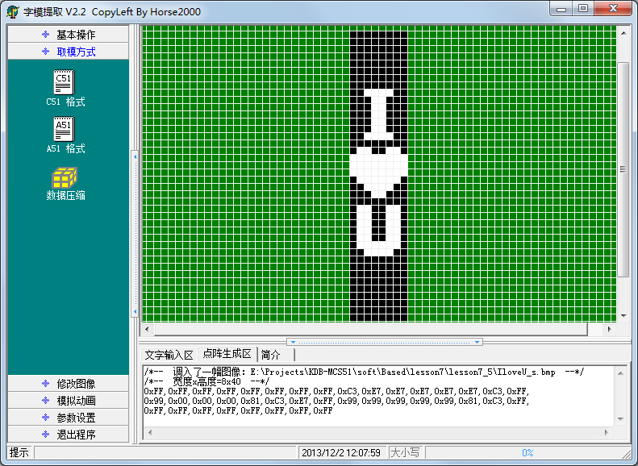

# 7.5 单片机 LED 点阵的纵向移动(动态显示)

点阵的动画显示，说到底就是对多张图片分别进行取模，使用程序算法巧妙的切换图片，多张图片组合起来就成了一段动画了，我们所看到的动画片、游戏等等，它们的基本原理也都是这样的。

上一节我们学了如何在点阵上画一个❤形，有时候我们希望这些显示是动起来的，而不是静止的。对于点阵本身已经没有多少的知识点可以介绍了，主要就是编程算法来解决问题了。比如我们现在要让点阵显示一个 I ❤ U 的动画，首先我们要把这个图形用取模软件画出来看一下，如图7-10所示。



图7-10 上下移动横向取模

这张图片共有40行，每8行组成一张点阵图片，并且每向上移动一行就出现了一张新图片，一共组成了32张图片。

用一个变量 index 来代表每张图片的起始位置，每次从 index 起始向下数8行代表了当前的图片，250 ms 改变一张图片，然后不停的动态刷新，这样图片就变成动画了。首先我们要对显示的图片进行横向取模，虽然这是32张图片，由于我们每一张图片都是和下一行连续的，所以实际的取模值只需要40个字节就可以完成，我们来看看程序。

```
#include <reg52.h>

sbit ADDR0 = P1^0;
sbit ADDR1 = P1^1;
sbit ADDR2 = P1^2;
sbit ADDR3 = P1^3;
sbit ENLED = P1^4;

unsigned char code image[] = { //图片的字模表
    0xFF,0xFF,0xFF,0xFF,0xFF,0xFF,0xFF,0xFF,
    0xC3,0xE7,0xE7,0xE7,0xE7,0xE7,0xC3,0xFF,
    0x99,0x00,0x00,0x00,0x81,0xC3,0xE7,0xFF,
    0x99,0x99,0x99,0x99,0x99,0x81,0xC3,0xFF,
    0xFF,0xFF,0xFF,0xFF,0xFF,0xFF,0xFF,0xFF
};

void main(){
    EA = 1;  //使能总中断
    ENLED = 0;  //使能 U4，选择 LED 点阵
    ADDR3 = 0;
    TMOD = 0x01; //设置 T0 为模式1
    TH0 = 0xFC; //为 T0 赋初值 0xFC67，定时1 ms
    TL0 = 0x67;
    ET0 = 1;  //使能 T0 中断
    TR0 = 1;  //启动 T0
    while (1);
    }
    /* 定时器0中断服务函数 */
    void InterruptTimer0() interrupt 1{
    static unsigned char i = 0; //动态扫描的索引
    static unsigned char tmr = 0; //250 ms 软件定时器
    static unsigned char index = 0; //图片刷新索引
   
    TH0 = 0xFC; //重新加载初值
    TL0 = 0x67;
    //以下代码完成 LED 点阵动态扫描刷新
    P0 = 0xFF;  //显示消隐
    switch (i){
        case 0: ADDR2=0; ADDR1=0; ADDR0=0; i++; P0=image[index+0]; break;
        case 1: ADDR2=0; ADDR1=0; ADDR0=1; i++; P0=image[index+1]; break;
        case 2: ADDR2=0; ADDR1=1; ADDR0=0; i++; P0=image[index+2]; break;
        case 3: ADDR2=0; ADDR1=1; ADDR0=1; i++; P0=image[index+3]; break;
        case 4: ADDR2=1; ADDR1=0; ADDR0=0; i++; P0=image[index+4]; break;
        case 5: ADDR2=1; ADDR1=0; ADDR0=1; i++; P0=image[index+5]; break;
        case 6: ADDR2=1; ADDR1=1; ADDR0=0; i++; P0=image[index+6]; break;
        case 7: ADDR2=1; ADDR1=1; ADDR0=1; i=0; P0=image[index+7]; break;
        default: break;
    }
    //以下代码完成每250 ms 改变一帧图像
    tmr++;
    if (tmr >= 250){  //达到250 ms 时改变一次图片索引
        tmr = 0;
        index++;
        if (index >= 32){  //图片索引达到32后归零
           index = 0;
        }
    }
}
```

大家把这个程序下载到单片机上看看效果，一个 I ❤ U 一直往上走动的动画就出现了，现在还有哪位敢说我们工科同学不懂浪漫的？还需要用什么玫瑰花取悦女朋友吗？一点技术含量都没有，要玩就玩点高科技，呵呵。

当然，别光图开心，学习我们还要继续。往上走动的动画我写出来了，那往下走动的动画，大家就要自己独立完成了，不要偷懒，一定要去写代码调试代码。瞪眼看只能了解知识，而能力是在真正的写代码、调试代码这种实践中培养起来的。