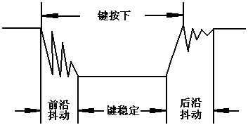
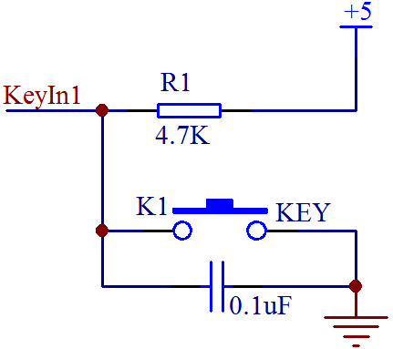

# 8.6 单片机按键消抖程序

通常按键所用的开关都是机械弹性开关，当机械触点断开、闭合时，由于机械触点的弹性作用，一个按键开关在闭合时不会马上就稳定的接通，在断开时也不会一下子彻底断开，而是在闭合和断开的瞬间伴随了一连串的抖动，如图8-10所示。 



图8-10 按键抖动状态图

按键稳定闭合时间长短是由操作人员决定的，通常都会在 100 ms 以上，刻意快速按的话能达到 40-50 ms 左右，很难再低了。抖动时间是由按键的机械特性决定的，一般都会在 10 ms 以内，为了确保程序对按键的一次闭合或者一次断开只响应一次，必须进行按键的消抖处理。当检测到按键状态变化时，不是立即去响应动作，而是先等待闭合或断开稳定后再进行处理。按键消抖可分为硬件消抖和软件消抖。

硬件消抖就是在按键上并联一个电容，如图8-11所示，利用电容的充放电特性来对抖动过程中产生的电压毛刺进行平滑处理，从而实现消抖。但实际应用中，这种方式的效果往往不是很好，而且还增加了成本和电路复杂度，所以实际中使用的并不多。 



图8-11 硬件电容消抖

在绝大多数情况下，我们是用软件即程序来实现消抖的。最简单的消抖原理，就是当检测到按键状态变化后，先等待一个 10 ms 左右的延时时间，让抖动消失后再进行一次按键状态检测，如果与刚才检测到的状态相同，就可以确认按键已经稳定的动作了。将上一个的程序稍加改动，得到新的带消抖功能的程序如下。 

```
#include <reg52.h>

sbit ADDR0 = P1^0;
sbit ADDR1 = P1^1;
sbit ADDR2 = P1^2;
sbit ADDR3 = P1^3;
sbit ENLED = P1^4;
sbit KEY1 = P2^4;
sbit KEY2 = P2^5;
sbit KEY3 = P2^6;
sbit KEY4 = P2^7;

unsigned char code LedChar[] = { //数码管显示字符转换表
    0xC0, 0xF9, 0xA4, 0xB0, 0x99, 0x92, 0x82, 0xF8,
    0x80, 0x90, 0x88, 0x83, 0xC6, 0xA1, 0x86, 0x8E
};

void delay();
void main(){
    bit keybuf = 1; //按键值暂存，临时保存按键的扫描值
    bit backup = 1; //按键值备份，保存前一次的扫描值
    unsigned char cnt = 0; //按键计数，记录按键按下的次数
   
    ENLED = 0;  //选择数码管 DS1 进行显示
    ADDR3 = 1;
    ADDR2 = 0;
    ADDR1 = 0;
    ADDR0 = 0;
    P2 = 0xF7;  //P2.3 置 0，即 KeyOut1 输出低电平
    P0 = LedChar[cnt];  //显示按键次数初值

    while (1){
        keybuf = KEY4;  //把当前扫描值暂存
        if (keybuf != backup){  //当前值与前次值不相等说明此时按键有动作
            delay();  //延时大约 10ms
            if (keybuf == KEY4){  //判断扫描值有没有发生改变，即按键抖动
                if (backup == 0){  //如果前次值为 0，则说明当前是弹起动作
                    cnt++;  //按键次数+1
                    //只用 1 个数码管显示，所以加到 10 就清零重新开始
                    if (cnt >= 10){
                       cnt = 0;
                    }
                    P0 = LedChar[cnt]; //计数值显示到数码管上
                }
                backup = keybuf; //更新备份为当前值，以备进行下次比较
            }
        }
    }
}
/* 软件延时函数，延时约 10ms */
void delay(){
    unsigned int i = 1000;
    while (i--);
}
```

大家把这个程序下载到板子上再进行试验试试，按一下按键而数字加了多次的问题是不是就这样解决了？把问题解决掉的感觉是不是很爽呢？

这个程序用了一个简单的算法实现了按键的消抖。作为这种很简单的演示程序，我们可以这样来写，但是实际做项目开发的时候，程序量往往很大，各种状态值也很多， while(1)这个主循环要不停的扫描各种状态值是否有发生变化，及时的进行任务调度，如果程序中间加了这种 delay 延时操作后，很可能某一事件发生了，但是我们程序还在进行 delay 延时操作中，当这个事件发生完了，程序还在 delay 操作中，当我们 delay 完事再去检查的时候，已经晚了，已经检测不到那个事件了。为了避免这种情况的发生，我们要尽量缩短 while(1)循环一次所用的时间，而需要进行长时间延时的操作，必须想其它的办法来处理。

那么消抖操作所需要的延时该怎么处理呢？其实除了这种简单的延时，我们还有更优异的方法来处理按键抖动问题。举个例子：我们启用一个定时中断，每 2 ms 进一次中断，扫描一次按键状态并且存储起来，连续扫描8次后，看看这连续8次的按键状态是否是一致的。8次按键的时间大概是 16 ms，这 16 ms 内如果按键状态一直保持一致，那就可以确定现在按键处于稳定的阶段，而非处于抖动的阶段，如图8-12。 


图8-12 按键连续扫描判断

假如左边时间是起始0时刻，每经过 2 ms 左移一次，每移动一次，判断当前连续的8次按键状态是不是全1或者全0，如果是全1则判定为弹起，如果是全0则判定为按下，如果0和1交错，就认为是抖动，不做任何判定。想一下，这样是不是比简单的延时更加可靠？

利用这种方法，就可以避免通过延时消抖占用单片机执行时间，而是转化成了一种按键状态判定而非按键过程判定，我们只对当前按键的连续 16 ms 的8次状态进行判断，而不再关心它在这 16 ms 内都做了什么事情，那么下面就按照这种思路用程序实现出来，同样只以 K4 为例。 

```
#include <reg52.h>

sbit ADDR0 = P1^0;
sbit ADDR1 = P1^1;
sbit ADDR2 = P1^2;
sbit ADDR3 = P1^3;
sbit ENLED = P1^4;
sbit KEY1 = P2^4;
sbit KEY2 = P2^5;
sbit KEY3 = P2^6;
sbit KEY4 = P2^7;

unsigned char code LedChar[] = {  //数码管显示字符转换表
    0xC0, 0xF9, 0xA4, 0xB0, 0x99, 0x92, 0x82, 0xF8,
    0x80, 0x90, 0x88, 0x83, 0xC6, 0xA1, 0x86, 0x8E
};
bit KeySta = 1;  //当前按键状态

void main(){
    bit backup = 1;  //按键值备份，保存前一次的扫描值
    unsigned char cnt = 0;  //按键计数，记录按键按下的次数
    EA = 1;  //使能总中断
    ENLED = 0;  //选择数码管 DS1 进行显示
    ADDR3 = 1;
    ADDR2 = 0;
    ADDR1 = 0;
    ADDR0 = 0;
    TMOD = 0x01; //设置 T0 为模式 1
    TH0 = 0xF8; //为 T0 赋初值 0xF8CD，定时 2ms
    TL0 = 0xCD;
    ET0 = 1;  //使能 T0 中断
    TR0 = 1;  //启动 T0
    P2 = 0xF7;  //P2.3 置 0，即 KeyOut1 输出低电平
    P0 = LedChar[cnt];  //显示按键次数初值
   
    while (1){
        if (KeySta != backup){  //当前值与前次值不相等说明此时按键有动作
            if (backup == 0){  //如果前次值为 0，则说明当前是弹起动作
                cnt++;  //按键次数+1
                if (cnt >= 10){  //只用 1 个数码管显示，所以加到 10 就清零重新开始
                    cnt = 0;
                }
                P0 = LedChar[cnt]; //计数值显示到数码管上
            }
            //更新备份为当前值，以备进行下次比较
            backup = KeySta;
        }
    }
}
/* T0 中断服务函数，用于按键状态的扫描并消抖 */
void InterruptTimer0() interrupt 1{
    //扫描缓冲区，保存一段时间内的扫描值
    static unsigned char keybuf = 0xFF;
   
    TH0 = 0xF8; //重新加载初值
    TL0 = 0xCD;
    //缓冲区左移一位，并将当前扫描值移入最低位
    keybuf = (keybuf<<1) | KEY4;
    //连续 8 次扫描值都为 0，即 16ms 内都只检测到按下状态时，可认为按键已按下
    if (keybuf == 0x00){
        KeySta = 0;
    //连续 8 次扫描值都为 1，即 16ms 内都只检测到弹起状态时，可认为按键已弹起
    }else if (keybuf == 0xFF){
        KeySta = 1;
    }
    else{
        //其它情况则说明按键状态尚未稳定，则不对 KeySta 变量值进行更新
    }
}
```

这个算法是我们在实际工程中经常使用按键所总结的一个比较好的方法，介绍给大家，今后都可以用这种方法消抖了。当然，按键消抖也还有其它的方法，程序实现更是多种多样，大家也可以再多考虑下其它的算法，拓展下思路。