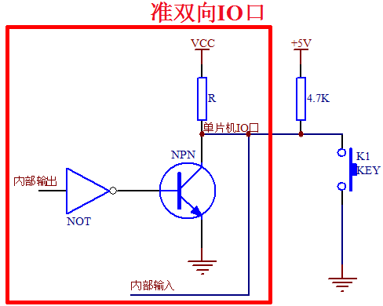
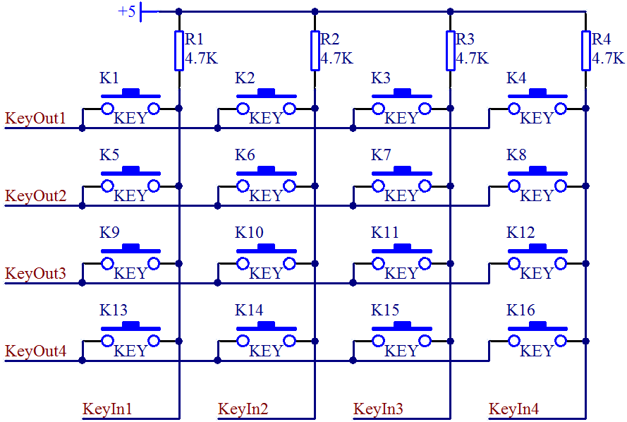

# 8.4 单片机按键介绍

## 独立按键

常用的按键电路有两种形式，独立式按键和矩阵式按键，独立式按键比较简单，它们各自与独立的输入线相连接，如图8-6所示。

图8-6 独立式按键原理图

4条输入线接到单片机的 IO 口上，当按键 K1 按下时，+5 V 通过电阻 R1 然后再通过按键 K1 最终进入 GND 形成一条通路，那么这条线路的全部电压都加到了 R1 这个电阻上，KeyIn1 这个引脚就是个低电平。当松开按键后，线路断开，就不会有电流通过，那么 KeyIn1 和 +5 V 就应该是等电位，是一个高电平。我们就可以通过 KeyIn1 这个 IO 口的高低电平来判断是否有按键按下。

这个电路中按键的原理我们清楚了，但是实际上在我们的单片机 IO 口内部，也有一个上拉电阻的存在。我们的按键是接到了 P2 口上，P2 口上电默认是准双向 IO 口，我们来简单了解一下这个准双向 IO 口的电路，如图8-7所示。 

图8-7 准双向 IO 口结构图

首先说明一点，就是我们现在绝大多数单片机的 IO 口都是使用 MOS 管而非三极管，但用在这里的 MOS 管其原理和三极管是一样的，因此在这里我用三极管替代它来进行原理讲解，把前面讲过的三极管的知识搬过来，一切都是适用的，有助于理解。

图8-7方框内的电路都是指单片机内部部分，方框外的就是我们外接的上拉电阻和按键。这个地方大家要注意一下，就是当我们要读取外部按键信号的时候，单片机必须先给该引脚写“1”，也就是高电平，这样我们才能正确读取到外部按键信号，我们来分析一下缘由。

当内部输出是高电平，经过一个反向器变成低电平，NPN 三极管不会导通，那么单片机IO 口从内部来看，由于上拉电阻 R 的存在，所以是一个高电平。当外部没有按键按下将电平拉低的话，VCC 也是 +5 V，它们之间虽然有2个电阻，但是没有压差，就不会有电流，线上所有的位置都是高电平，这个时候我们就可以正常读取到按键的状态了。

当内部输出是个低电平，经过一个反相器变成高电平，NPN 三极管导通，那么单片机的内部 IO 口就是个低电平，这个时候，外部虽然也有上拉电阻的存在，但是两个电阻是并联关系，不管按键是否按下，单片机的 IO 口上输入到单片机内部的状态都是低电平，我们就无法正常读取到按键的状态了。

这个和水流其实很类似的，内部和外部，只要有一边是低电位，那么电流就会顺流而下，由于只有上拉电阻，下边没有电阻分压，直接到 GND 上了，所以不管另外一边是高还是低，那电平肯定就是低电平了。

从上面的分析就可以得出一个结论，这种具有上拉的准双向 IO 口，如果要正常读取外部信号的状态，必须首先得保证自己内部输出的是1，如果内部输出0，则无论外部信号是1还是0，这个引脚读进来的都是0。
 
## 矩阵按键

在某一个系统设计中，如果需要使用很多的按键时，做成独立按键会大量占用 IO 口，因此我们引入了矩阵按键的设计。如图8-8所示，是我们的 KST-51 开发板上的矩阵按键电路原理图，使用8个 IO 口来实现了16个按键。 

图8-8 矩阵按键原理图

如果独立按键理解了，矩阵按键也不难理解，那么我们一起来分析一下。图8-8中，一共有4组按键，我们只看其中一组，如图8-9所示。大家认真看一下，如果 KeyOut1 输出一个低电平，KeyOut1 就相当于是 GND，是否相当于4个独立按键呢。当然这时候 KeyOut2、KeyOut3、KeyOut4 都必须输出高电平，它们都输出高电平才能保证与它们相连的三路按键不会对这一路产生干扰，大家可以对照两张原理图分析一下。 

图8-9 矩阵按键变独立按键示意图