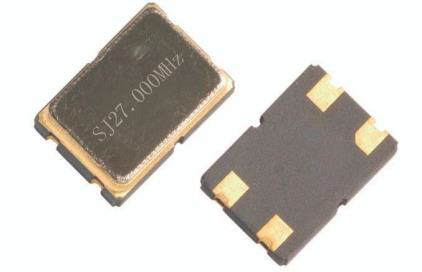
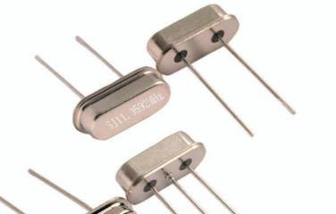
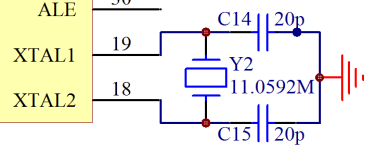
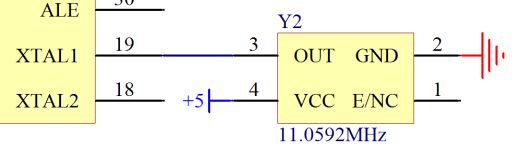
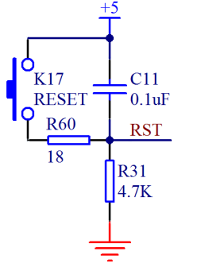

# 8.1 单片机最小系统解析(电源、晶振和复位电路)

## 电源

我们在学习过程中，很多指标都是直接用的概念指标，比如我们说+5 V 代表1，GND 代表0等等。但在实际电路中的电压值并不是完全精准的，那这些指标允许范围是什么呢？随着我们所学的内容不断增多，大家要慢慢培养一种阅读数据手册的能力。

比如，我们要使用 STC89C52RC 单片机的时候，找到它的数据手册第11页，看第二项——工作电压：5.5 V～3.4 V（5 V 单片机），这个地方就说明这个单片机正常的工作电压是个范围值，只要电源 VCC 在 5.5 V～3.4 V 之间都可以正常工作，电压超过5.5 V 是绝对不允许的，会烧坏单片机，电压如果低于3.4 V，单片机不会损坏，但是也不能正常工作。而在这个范围内，最典型、最常用的电压值就是 5V，这就是后面括号里“5 V 单片机”这个名称的由来。除此之外，还有一种常用的工作电压范围是2.7 V～3.6 V、典型值是3.3 V 的单片机，也就是所谓的“3.3 V 单片机”。日后随着大家接触更多的器件，对这点会有更深刻的理解。

现在我们再顺便多了解一点，大家打开 74HC138 的数据手册，会发现 74HC138 手册的第二页也有一个表格，上边写了 74HC138 的工作电压范围，最小值是4.75 V，额定值是5 V，最大值是5.25 V，可以得知它的工作电压范围是4.75 V～5.25 V。这个地方讲这些目的是让大家清楚的了解，我们获取器件工作参数的一个最重要、也是最权威的途径，就是查阅该器件的数据手册。 

## 晶振

晶振通常分为无源晶振和有源晶振两种类型，无源晶振一般称之为 crystal（晶体），而有源晶振则叫做 oscillator（振荡器）。

有源晶振是一个完整的谐振振荡器，它是利用石英晶体的压电效应来起振，所以有源晶振需要供电，当我们把有源晶振电路做好后，不需要外接其它器件，只要给它供电，它就可以主动产生振荡频率，并且可以提供高精度的频率基准，信号质量也比无源信号要好。

无源晶振自身无法振荡起来，它需要芯片内部的振荡电路一起工作才能振荡，它允许不同的电压，但是信号质量和精度较有源晶振差一些。相对价格来说，无源晶振要比有源晶振价格便宜很多。无源晶振两侧通常都会有个电容，一般其容值都选在10 pF~40 pF 之间，如果手册中有具体电容大小的要求则要根据要求来选电容，如果手册没有要求，我们用20 pF 就是比较好的选择，这是一个长久以来的经验值，具有极其普遍的适用性。

我们来认识下比较常用的两种晶振的样貌，如图8-1和图8-2所示。 

图8-1 有源晶振实物图

图8-2 无源晶振实物图

有源晶振通常有4个引脚，VCC，GND，晶振输出引脚和一个没有用到的悬空引脚（有些晶振也把该引脚作为使能引脚）。无源晶振有2个或3个引脚，如果是3个引脚的话，中间引脚接是晶振的外壳，使用时要接到 GND，两侧的引脚就是晶体的2个引出脚了，这两个引脚作用是等同的，就像是电阻的2个引脚一样，没有正负之分。对于无源晶振，用我们的单片机上的两个晶振引脚接上去即可，而有源晶振，只接到单片机的晶振的输入引脚上，输出引脚上不需要接，如图8-3和图8-4所示。 

图8-3 无源晶振接法

图8-4 有源晶振接法 
                                         
## 复位电路

我们先来分析一下 KST-51 开发板上的复位电路，如图8-5所示。 

图8-5 单片机复位电路

当这个电路处于稳态时，电容起到隔离直流的作用，隔离了+5 V，而左侧的复位按键是弹起状态，下边部分电路就没有电压差的产生，所以按键和电容 C11 以下部分的电位都是和GND 相等的，也就是 0V。我们这个单片机是高电平复位，低电平正常工作，所以正常工作的电压是0 V，没有问题。

我们再来分析从没有电到上电的瞬间，电容 C11 上方电压是5 V，下方是0 V，根据我们初中所学的知识，电容 C11 要进行充电，正离子从上往下充电，负电子从 GND 往上充电，这个时候电容对电路来说相当于一根导线，全部电压都加在了 R31 这个电阻上，那么 RST端口位置的电压就是5 V，随着电容充电越来越多，即将充满的时候，电流会越来越小，那 RST 端口上的电压值等于电流乘以 R31 的阻值，也就会越来越小，一直到电容完全充满后，线路上不再有电流，这个时候 RST 和 GND 的电位就相等了也就是0 V 了。

从这个过程上来看，我们加上这个电路，单片机系统上电后，RST 引脚会先保持一小段时间的高电平而后变成低电平，这个过程就是上电复位的过程。那这个“一小段时间”到底是多少才合适呢？每种单片机不完全一样，51单片机手册里写的是持续时间不少于2个机器周期的时间。复位电压值，每种单片机不完全一样，我们按照通常值0.7 VCC 作为复位电压值，复位时间的计算过程比较复杂，我这里只给大家一个结论，时间 t=1.2 RC，我们用的 R是4700欧，C 是0.0000001法，那么计算出 t 就是 0.000564秒，即564 us，远远大于2个机器周期(2 us)，在电路设计的时候一般留够余量就行。

按键复位（即手动复位）有2个过程，按下按键之前，RST 的电压是0 V，当按下按键后电路导通，同时电容也会在瞬间进行放电，RST 电压值变化为4700 VCC/(4700+18)，会处于高电平复位状态。当松开按键后就和上电复位类似了，先是电容充电，后电流逐渐减小直到 RST 电压变0 V 的过程。我们按下按键的时间通常都会有几百毫秒，这个时间足够复位了。

按下按键的瞬间，电容两端的5 V 电压（注意不是电源的5 V 和 GND 之间）会被直接接通，此刻会有一个瞬间的大电流冲击，会在局部范围内产生电磁干扰，为了抑制这个大电流所引起的干扰，我们这里在电容放电回路中串入一个18欧的电阻来限流。

如果有的同学已经想开始 DIY 设计自己的电路板，那单片机最小系统的设计现在已经有了足够的理论依据了，可以考虑尝试了。基础比较薄弱的同学先不要着急，继续跟着往下学，把课程都学完了再动手操作也不迟，磨刀不误砍柴工。